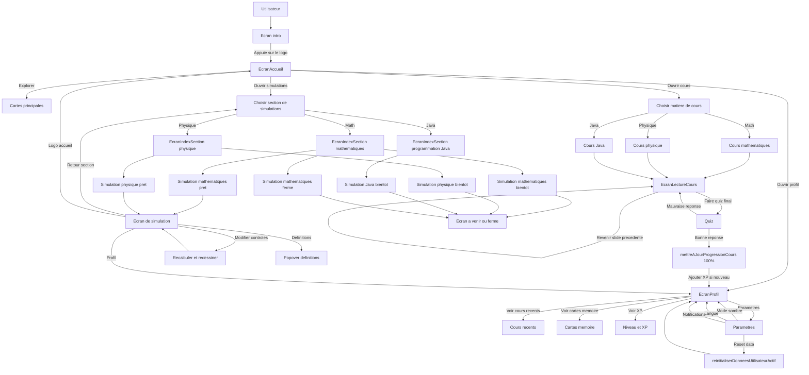
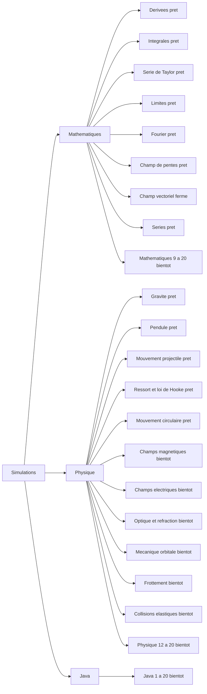
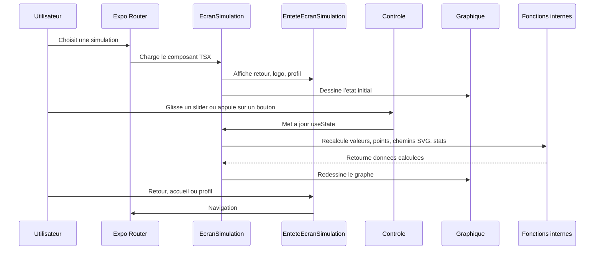
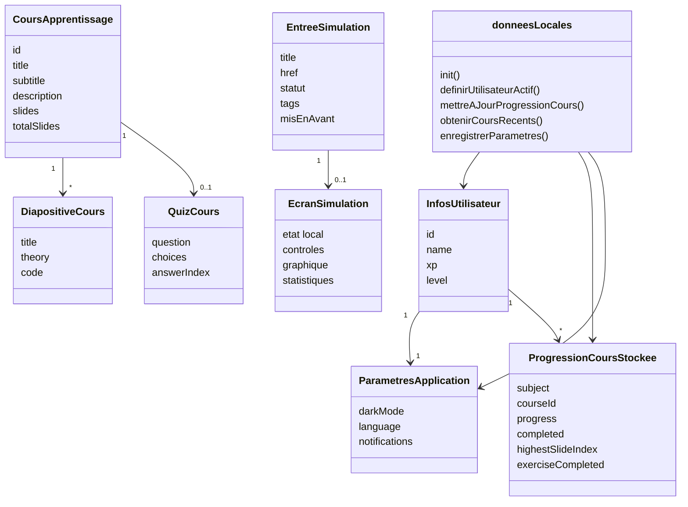
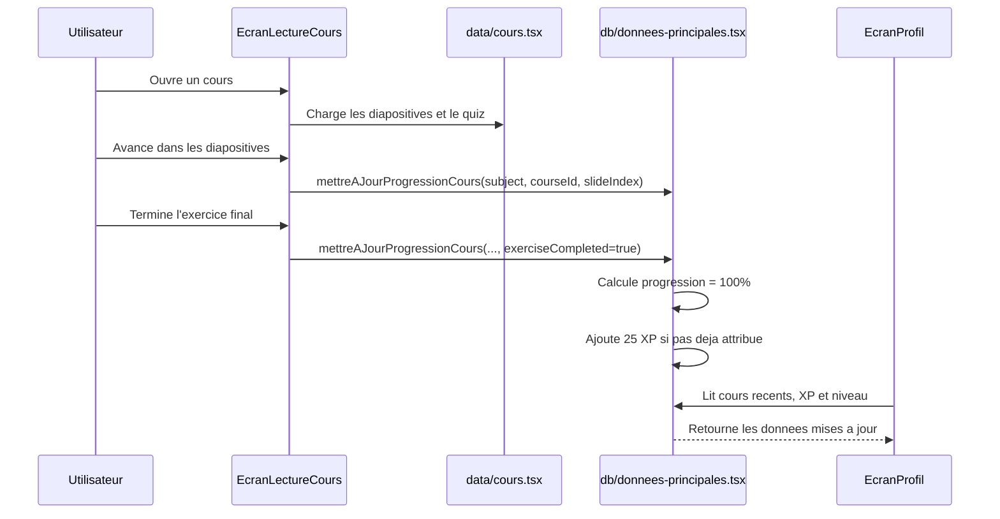
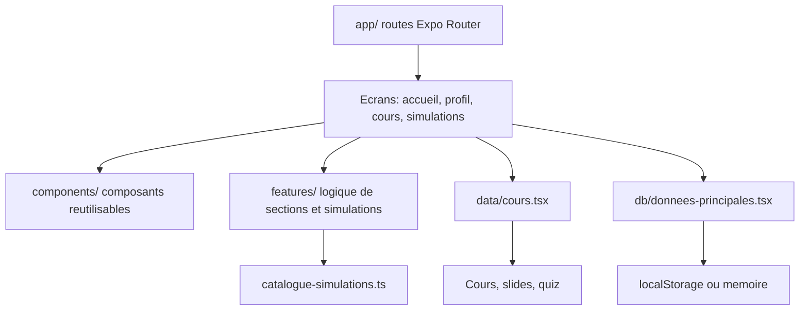
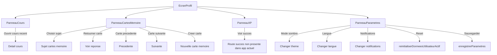

# Evidex - Application d'apprentissage interactive

Projet final - Programmation  
Tony Khabbaz & Aris Hadjeb  
Version complete corrigee

## 1. Introduction

Evidex est une application educative interactive qui vise a rendre plus concrets des concepts souvent abstraits en mathematiques, en physique et en programmation Java. L'application ne remplace pas le cours theorique: elle sert plutot de support d'experimentation ou l'utilisateur peut consulter des cours, lancer des simulations, suivre sa progression et accumuler de l'XP lorsqu'il complete des activites.

Le projet est construit avec Expo, React Native et TypeScript. Son architecture est organisee autour de routes, de composants reutilisables, de donnees de cours, d'une couche de stockage locale et de modules de simulation.

## 2. Problematique

Plusieurs notions en mathematiques, en physique et en programmation sont difficiles a comprendre lorsqu'elles sont presentees uniquement sous forme de formules, d'equations ou de syntaxe. Une derivee est souvent apprise comme une formule alors qu'elle represente aussi une pente instantanee. Une integrale est souvent traitee comme une operation de calcul alors qu'elle peut etre visualisee comme une aire accumulee. En physique, les forces, les trajectoires et l'energie deviennent plus faciles a comprendre lorsqu'on observe leur effet sur un objet. En programmation Java, les variables, conditions, boucles, tableaux et methodes sont plus clairs lorsqu'on les relie a une logique d'execution.

Evidex repond a ce probleme en proposant un environnement ou l'etudiant peut naviguer entre cours, simulations et suivi de progression. L'application rend visibles les relations entre les parametres, les resultats et les concepts etudies.

## 3. Objectifs du projet

Les objectifs principaux sont:

- proposer une application educative simple a utiliser sur mobile et sur web avec Expo;
- organiser le contenu en trois domaines: mathematiques, physique et Java;
- offrir des simulations interactives ou animees pour illustrer certains concepts;
- integrer des cours courts avec diapositives, exemples et quiz;
- sauvegarder la progression locale de l'utilisateur;
- ajouter un systeme de profil avec XP, niveau, cours recents et parametres;
- construire une base technique extensible pour ajouter de nouvelles simulations.

## 4. Fonctionnalites realisees

L'application contient un ecran d'introduction anime, puis un ecran d'accueil central. Depuis l'accueil, l'utilisateur peut acceder aux cours, aux simulations et au profil.

Le module de cours est organise par matiere. Les cours actuellement presents dans le code sont:

- mathematiques: derivees, integrales et limites;
- physique: cinematique, forces et energie;
- Java: variables, types de donnees, transtypage, chaines de caracteres, operateurs, classe `Math`, conditions, `else if`, `switch`, boucles `while`, boucles `for`, tableaux, methodes, classes et objets, logique booleenne.

Chaque cours contient des diapositives de theorie, parfois du code d'exemple, puis un quiz. La progression est sauvegardee par utilisateur actif. Un cours n'est considere complet qu'apres avoir atteint la fin et valide l'exercice final.

Le module de simulations contient un catalogue separe des cours. Les simulations deja marquees comme pretes sont:

- mathematiques: derivees, integrales, serie de Taylor, limites, Fourier, champ de pentes et series;
- physique: gravite, pendule, mouvement projectile, ressort et loi de Hooke, mouvement circulaire.

Certaines simulations sont encore indiquees comme a venir ou fermees dans le catalogue, par exemple les champs magnetiques, les champs electriques, l'optique, la mecanique orbitale, les frottements, les collisions elastiques et les simulations Java avancees. Elles doivent donc etre presentees comme limites actuelles, pas comme fonctionnalites terminees.

Le profil utilisateur permet de consulter les cours recents, les cours actifs, les cours termines, l'XP, le niveau et les parametres. Les parametres incluent le mode sombre, la langue et les notifications. L'application gere aussi plusieurs utilisateurs locaux par nom.

## 5. Architecture et technologies

Le projet repose sur Expo Router pour la navigation. Les fichiers dans `app/` representent les routes principales: introduction, onglets internes, accueil, profil, cours, mathematiques, physique, programmation Java et simulations.

Les composants reutilisables sont places dans `components/`, par exemple les panneaux du profil, la barre superieure, les cartes de cours et les composants thematiques. Les fonctionnalites plus complexes sont regroupees dans `features/`, notamment les simulations et les ecrans de section.

Les donnees de cours sont centralisees dans `data/cours.tsx`. Ce fichier contient les cours, les diapositives et les quiz. Le catalogue des simulations est separe dans `features/simulations/catalogue-simulations.ts`, ce qui permet de distinguer les cours theorique-pratiques des simulations libres.

La couche de persistance est dans `db/donnees-principales.tsx`. Meme si une dependance SQLite est presente dans `package.json`, le code actuel n'utilise pas une base SQLite reelle. La sauvegarde fonctionne avec `localStorage` lorsque l'application tourne sur web, avec un fallback en memoire si `localStorage` n'est pas disponible. Il est donc plus exact de parler de stockage local applicatif plutot que de base de donnees SQLite operationnelle.

Technologies utilisees reellement:

- React Native pour l'interface mobile;
- Expo et Expo Router pour le lancement, la navigation et le routage;
- TypeScript/TSX pour structurer le code;
- React Native Animated pour plusieurs animations;
- React Native SVG et rendu mathematique pour certaines visualisations et formules;
- stockage local via une couche `donneesLocales` maison;
- WebStorm, Git, npm et Node.js comme outils de developpement.

Node.js n'est pas un backend actif du projet. Il sert principalement a executer les outils de developpement, installer les dependances et lancer Expo.

## 6. Contenu academique integre

### 6.1 Mathematiques

Le contenu mathematique actuel couvre les derivees, les integrales et les limites dans les cours. Les simulations couvrent davantage de sujets: derivees, integrales, serie de Taylor, limites, Fourier, champ de pentes, champ vectoriel ferme et series.

Les notions abordees incluent:

- pente instantanee et tangente;
- aire sous une courbe;
- sommes de Riemann;
- comportement local et limites;
- approximation par series;
- representation de champs et de directions.

### 6.2 Physique

Les cours de physique presents dans le code portent sur la cinematique, les forces et l'energie. Les simulations pretes ajoutent des experiences visuelles sur la gravite, le pendule, le mouvement projectile, la loi de Hooke et le mouvement circulaire.

Les notions abordees incluent:

- position, vitesse et acceleration;
- relation entre force, masse et acceleration;
- energie cinetique, potentielle et conservation;
- attraction gravitationnelle;
- oscillations et periode;
- trajectoires et mouvements circulaires.

### 6.3 Programmation Java

Le module Java contient surtout des cours structures et des exercices. Les simulations Java dans le catalogue sont encore indiquees comme "Bientot", il faut donc eviter de les presenter comme terminees.

Les cours Java couvrent:

- variables et types;
- transtypage;
- chaines de caracteres;
- operateurs;
- conditions `if`, `else if` et `switch`;
- boucles `while` et `for`;
- tableaux;
- methodes;
- classes et objets;
- logique booleenne.

## 7. Innovation

L'innovation principale du projet vient de l'association entre contenu academique, visualisation et suivi de progression. L'utilisateur n'est pas seulement en train de lire un texte: il peut explorer des cours, observer des animations, ouvrir des simulations et voir sa progression evoluer.

Le projet se distingue aussi par son approche modulaire. Les cours et les simulations sont separes, ce qui permet d'ajouter du contenu progressivement sans devoir modifier toute l'application. Le catalogue de simulations indique clairement ce qui est pret, ce qui est ferme et ce qui est a venir.

## 8. Difficultes rencontrees

La premiere difficulte a ete l'organisation d'un projet avec plusieurs domaines differents. Les mathematiques, la physique et Java n'ont pas les memes besoins: certains sujets se presentent mieux sous forme de cours, d'autres sous forme de simulation. Il a donc fallu separer les cours, les simulations et la navigation pour garder une structure claire.

Une autre difficulte a ete la gestion de la progression. Il ne suffisait pas d'afficher des cours: il fallait enregistrer l'utilisateur actif, memoriser les cours ouverts, calculer le pourcentage de progression, distinguer un cours simplement consulte d'un cours reellement termine et attribuer l'XP une seule fois.

L'adaptation mobile/web a aussi pose des contraintes. L'application utilise React Native et Expo, mais certaines parties comme `localStorage`, les evenements `window` ou les comportements de defilement sont plus proches du web. Il a fallu prevoir des conditions pour eviter les erreurs lorsque certaines APIs ne sont pas disponibles.

La qualite visuelle a demande beaucoup d'ajustements. L'accueil contient des animations, des cartes, des bulles decoratives et un carrousel. Il fallait eviter les chevauchements, garder des tailles lisibles sur petit ecran et maintenir une interface coherente avec le profil et les sections.

Enfin, le projet contient deja plusieurs simulations et de nombreuses entrees a venir. La difficulte a ete de presenter clairement l'etat reel du projet: certains modules sont fonctionnels, d'autres sont en preparation. Cette distinction est importante pour que le rapport reste coherent avec le code.

## 9. Echeancier detaille

| Periode | Travail prevu | Travail realise |
| --- | --- | --- |
| Semaine 1 | Definition du sujet et des objectifs | Choix d'une application educative interactive autour des maths, de la physique et de Java |
| Semaine 2 | Mise en place du projet | Creation du projet Expo/React Native, configuration TypeScript, structure initiale des routes |
| Semaine 3 | Navigation et ecrans principaux | Ajout de l'ecran d'introduction, de l'accueil, du profil et des sections principales |
| Semaine 4 | Donnees de cours | Creation des cours par matiere, des diapositives, des quiz et du systeme de resume de cours |
| Semaine 5 | Progression utilisateur | Ajout de la couche `donneesLocales`, sauvegarde locale, utilisateurs, XP, niveaux, cours recents et accomplissements |
| Semaine 6 | Simulations mathematiques | Ajout des simulations de derivees, integrales, limites, Taylor, Fourier, champs et series |
| Semaine 7 | Simulations physiques | Ajout des simulations de gravite, pendule, projectile, ressort et mouvement circulaire |
| Semaine 8 | Interface et experience utilisateur | Amelioration de l'accueil, cartes, animations, profil, mode sombre et responsive design |
| Semaine 9 | Stabilisation | Correction d'incoherences, distinction entre contenu pret et contenu a venir, verification du catalogue |
| Semaine 10 | Rapport et presentation | Mise a jour du rapport, ajout des difficultes, echeancier, UML, perspectives et conclusion |

## 10. UML et flux de l'application

Les diagrammes suivants sont ecrits en Mermaid. Ils peuvent etre rendus dans WebStorm, VS Code avec une extension Mermaid, Mermaid Live Editor ou Mermaid Editor.

### 10.1 Parcours utilisateur global

### 10.2 Catalogue des simulations

### 10.3 Flux commun d'une simulation

### 10.4 Diagramme de classes logique

### 10.5 Sequence: completion d'un cours

### 10.6 Architecture logique

## 11. Options utilisateur dans les simulations

### 11.1 Simulations mathematiques

| Simulation | Options utilisateur principales | Resultat |
| --- | --- | --- |
| Derivees | choisir `x^2`, `x^3`, `sin(x)`, `e^x`, `ln(x)`, `cos(x)`; modifier `x0` avec boutons, slider ou saisie | recalcul de `f(x0)`, `f'(x0)`, point et tangente |
| Integrales | choisir fonction; choisir methode gauche, droite, milieu ou trapeze; modifier bornes et nombre de rectangles | comparaison entre aire approchee, aire exacte et erreur |
| Serie de Taylor | choisir fonction; modifier le nombre de termes | affichage du polynome d'approximation et de l'erreur |
| Limites | choisir fonction; modifier la distance d'approche | affichage des points gauche/droite et de la valeur limite |
| Fourier | choisir signal carre, dent de scie ou triangle; modifier le nombre d'harmoniques | affichage de l'onde approximee et des phasors |
| Champ de pentes | choisir equation differentielle; modifier `y0` et la densite | affichage du champ et de la courbe solution |
| Series | choisir serie; modifier le nombre de termes | affichage des termes et des sommes partielles |
| Champ vectoriel | choisir champ; activer/desactiver les particules | simulation fermee dans le catalogue, composant present dans le code |

### 11.2 Simulations physiques

| Simulation | Options utilisateur principales | Resultat |
| --- | --- | --- |
| Gravite | modifier masse 1, masse 2 et distance | calcul de la force gravitationnelle et affichage visuel |
| Pendule | modifier longueur, gravite, amortissement, angle initial; demarrer/arreter | calcul de la periode, position et trajectoire |
| Mouvement projectile | modifier vitesse, angle, gravite; lancer; pause/reprise | affichage de la trajectoire et des statistiques de vol |
| Ressort et loi de Hooke | modifier constante `k`, masse, amplitude, amortissement; pause; reset | affichage du ressort, de l'oscillation et de la projection de phase |
| Mouvement circulaire | modifier rayon, vitesse et masse | calcul de l'acceleration et de la force centripete |

### 11.3 Simulations Java

Les routes Java 1 a 20 existent dans le catalogue, mais elles sont indiquees comme `bientot`. Le rapport doit donc les presenter comme perspectives d'amelioration plutot que comme simulations terminees.

## 12. Fonctions internes importantes

### 12.1 Core des simulations

| Fichier | Fonctions/composants |
| --- | --- |
| `infobulle-definition.tsx` | `InfobulleDefinition` |
| `symboles-mathematiques-flottants.tsx` | `versPourcentage`, `SymbolesMathematiquesFlottants` |
| `formater-formule.ts` | `versExposant`, `formaterFormulePourAffichage` |
| `rendu-formule.tsx`, `.native.tsx`, `.web.tsx` | `ComposantRenduFormule`, `RenduFormule` |
| `ecran-simulation-ligne.tsx` | `EcranSimulationLigne` |
| `entete-ecran-simulation.tsx` | `obtenirHrefSection`, `EnteteEcranSimulation` |
| `utiliser-intervalle-simulation.ts` | `utiliserIntervalleSimulation` |

### 12.2 Simulations mathematiques

| Simulation | Fonctions/composants internes |
| --- | --- |
| Derivees | `borner`, `formaterNombre`, `obtenirPointEcran`, `echantillonnerFonction`, `creerDonneesChemin`, `TraceChemin`, `GraphiqueDerivee`, `CurseurX`, `SimulationDerivees` |
| Integrales | `borner`, `obtenirPointEcran`, `echantillonnerFonction`, `creerDonneesChemin`, `TraceChemin`, `evaluerEchantillon`, `calculerApproximation`, `calculerAireReference`, `GraphiqueIntegrale`, `CurseurNumerique`, `SimulationIntegrales` |
| Serie de Taylor | `factorielle`, `borner`, `formaterNombre`, `etiquettePuissance`, `formaterDenominateurLatex`, `etiquetteTermeSigne`, `termeSigneLatex`, `obtenirPointEcran`, `echantillonnerFonction`, `creerDonneesChemin`, `GraphiqueTaylor`, `CurseurTermes`, `SimulationSerieTaylor` |
| Limites | `borner`, `formaterNombre`, `obtenirPointEcran`, `echantillonnerFonction`, `creerDonneesChemin`, `obtenirMarqueursApproche`, `GraphiqueLimite`, `CurseurApproche`, `SimulationLimites` |
| Fourier | `borner`, `formaterNombre`, `approximationFourier`, `obtenirPointOnde`, `creerChemin`, `GraphiqueOndeFourier`, `GraphiquePhaseurs`, `CurseurHarmoniques`, `SimulationFourier` |
| Champ de pentes | `borner`, `formaterNombre`, `obtenirPointEcran`, `creerChemin`, `construireCheminSolution`, `GraphiqueChampPentes`, `CurseurNumerique`, `SimulationChampDePentes` |
| Champ vectoriel | `borner`, `particuleAleatoire`, `versPointEcran`, `formaterInvariant`, `GraphiqueChampVectoriel`, `SimulationChampVectoriel` |
| Series | `borner`, `formaterValeur`, `creerCheminSvg`, `construireSommesPartielles`, `GraphiqueSommesPartielles`, `GraphiqueBarresTermes`, `CurseurNombreEntier`, `SimulationSeries` |

### 12.3 Simulations physiques

| Simulation | Fonctions/composants internes |
| --- | --- |
| Gravite | `borner`, `arrondirAuPas`, `obtenirPasAdaptatif`, `valeurDepuisPourcentageCurseur`, `pourcentageCurseurDepuisValeur`, `formaterValeurCompacte`, `decrireForce`, `CurseurNumerique`, `GraphiqueGravite`, `SimulationGravite` |
| Gravite physique pure | `calculerForceGravitationnelle`, `formaterForceNewtons`, `formaterForceNewtonsLatex`, `formaterScientifiqueLatex`, `formaterNombreScientifique`, `formaterScientifiqueCompact`, `formaterRatioPoidsCorps`, `formaterRatioPoidsCorpsLatex` |
| Pendule | `borner`, `arrondirAuPas`, `formaterNombre`, `polaireVersPoint`, `cheminArc`, `cheminTrace`, `CurseurNumerique`, `GraphiquePendule`, `SimulationPendule` |
| Projectile | `borner`, `arrondirAuPas`, `formaterNombre`, `obtenirValeursProjectile`, `creerCheminTrajectoire`, `CurseurNumerique`, `GraphiqueProjectile`, `SimulationMouvementProjectile` |
| Ressort et Hooke | `borner`, `arrondirAuPas`, `formaterNombre`, `formaterNombreMath`, `obtenirPhysiqueRessort`, `creerCheminRessort`, `CurseurNumerique`, `GraphiqueRessort`, `creerCheminProjection`, `GraphiqueProjectionPhase`, `SimulationRessortLoiHooke` |
| Mouvement circulaire | `borner`, `arrondirAuPas`, `formaterNombre`, `formaterNombreMath`, `cheminPointeFleche`, `CurseurNumerique`, `GraphiqueMouvementCirculaire`, `SimulationMouvementCirculaire` |

## 13. Options utilisateur hors simulations

## 14. Perspectives et ameliorations

Avec le double du temps, la priorite serait de terminer toutes les simulations marquees "Bientot", surtout en Java, car le module Java possede beaucoup de cours mais peu de simulations finalisees. Des simulations visuelles pour les variables, conditions, boucles, tableaux et methodes rendraient cette partie plus coherente avec l'objectif principal du projet.

Une deuxieme amelioration serait de remplacer ou completer le stockage local actuel par une vraie base SQLite sur mobile, ou par une synchronisation distante. Cela permettrait de conserver les donnees entre plusieurs appareils, d'avoir des comptes utilisateurs reels et de sauvegarder la progression de maniere plus robuste.

Il serait aussi utile d'ajouter plus de tests automatises. Le projet contient deja un test autour de la physique de la gravite, mais les calculs de progression, les quiz, les parametres, le mode sombre et les simulations pourraient etre mieux couverts.

L'application pourrait ensuite integrer un mode enseignant. Un enseignant pourrait choisir les cours a proposer, consulter la progression d'un groupe et ajouter ses propres questions. Cela transformerait Evidex en outil pedagogique utilisable dans un contexte de classe.

Enfin, l'experience utilisateur pourrait etre enrichie avec des objectifs quotidiens, des badges plus visibles, des statistiques detaillees, des animations plus completes et une meilleure accessibilite pour les petits ecrans.

## 15. Conclusion

Evidex est une application educative interactive qui combine cours, simulations et suivi de progression pour faciliter la comprehension de notions abstraites. Le projet montre une base technique solide avec Expo, React Native, TypeScript, une navigation structuree, des donnees de cours organisees et une couche locale de progression utilisateur.

La version actuelle est deja fonctionnelle pour consulter des cours, explorer plusieurs simulations de mathematiques et de physique, suivre son profil et sauvegarder localement l'avancement. Le rapport a ete ajuste pour mieux refleter le code reel: le projet utilise TypeScript, ne possede pas de backend Node.js, n'utilise pas encore SQLite comme stockage effectif et contient certaines simulations encore en preparation.

La suite naturelle du projet serait de completer les simulations restantes, renforcer la persistance des donnees, ajouter des tests et developper des fonctionnalites collaboratives ou enseignantes. Avec ces ameliorations, Evidex pourrait devenir une application d'apprentissage plus complete, plus fiable et plus utile pour accompagner les etudiants dans la comprehension des concepts scientifiques et informatiques.

## 16. Corrections principales par rapport a la V1

- Le nom du projet est uniformise sous "Evidex", avec "Evid.exe" comme reference possible au logo/branding.
- JavaScript seul a ete remplace par TypeScript/TSX lorsque l'on parle du code reel.
- SQLite a ete corrige: la dependance existe, mais le stockage actuel utilise `localStorage` ou la memoire via `db/donnees-principales.tsx`.
- Node.js a ete repositionne comme outil de developpement, pas comme backend actif.
- Les cours et simulations ont ete separes pour respecter l'architecture du code.
- Les simulations `pret`, `bientot` et `ferme` sont distinguees pour ne pas presenter des fonctionnalites non terminees comme livrees.
- Le module Java est presente comme un module de cours avance, avec simulations encore majoritairement a venir.

## 17. Consultation interactive des UML

Pour zoomer et naviguer dans les diagrammes Mermaid:

- option locale recommandee: VS Code avec l'extension "Markdown Mermaid Zoom";
- option web: Mermaid Editor, qui permet de coller un bloc Mermaid, zoomer, deplacer et exporter;
- option web locale/privee: Tidecharts, qui rend les diagrammes dans le navigateur avec pan/zoom.

Dans WebStorm, le Markdown peut rendre Mermaid, mais l'interaction zoom/pan est generalement meilleure dans VS Code avec l'extension dediee ou dans un editeur web Mermaid.
